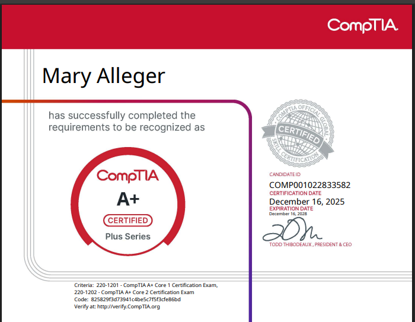

# Hi, I'm Mary 👋

### Data Analyst | Systems Architect | AI Collaborator

I am a Data Analyst and Python Developer specializing in AI-assisted workflows. My core strength lies in translating complex business questions into structured data pipelines and accessible digital solutions. 

I utilize advanced prompt engineering to accelerate code generation, allowing me to focus my energy entirely on system architecture, timeless UI/UX design, and extracting actionable insights. I don't just write code; I design systems that solve problems.

---

## 🛠️ My Technical Workflow & Stack

* **Data Engineering & ETL:** `pandas`, `numpy`, Data Cleaning, API Interception
* **Data Visualization:** `Looker Studio`, `matplotlib`, `seaborn`, Interactive Dashboards
* **Software Development:** Android App Publishing, Push Notifications, ProGuard Debugging
* **AI Collaboration:** Advanced Prompt Engineering, Automated Debugging, Architecture Prompting

---

## 📊 Featured Portfolio Projects

### 1. [The Rational Gambler: Multi-Game Lottery Pipeline](https://github.com/VeryMaryVeryJane/rational-gambler)
**Objective:** Engineered an automated data pipeline to compare the true Return on Investment (ROI) of national vs. state lottery games.
* Built an automated web scraper bypassing standard HTML to intercept live API web services.
* Engineered a financial model applying cash lump-sum penalties and state/federal tax rates to determine true Expected Value.
* **Tech:** `Python`, `pandas`, `requests`, `matplotlib`

### 2. [The Tier-Hunter: Optimizing Prize Probabilities](https://github.com/VeryMaryVeryJane/tier-hunter)
**Objective:** Shifted from macro-level jackpot analysis to a micro-level optimization problem to find the mathematical "sweet spots" in state lotteries.
* Isolated fixed prize tiers and engineered custom metrics (Return Multiplier and Tier Expected Value).
* Designed a multi-dimensional, logarithmic Risk/Reward scatter plot to visually uncover structural inefficiencies in game design.
* **Tech:** `Python`, `pandas`, `seaborn`, `matplotlib`

### 3. [Kentucky MMJ Doctors Interactive Dashboard](https://verymaryveryjane.github.io/Kentucky-MMJ-Doctors-Interactive-Dashboard/)
**Objective:** Engineered and deployed an interactive, public-facing dashboard to map and track medical marijuana doctors across Kentucky.
* Successfully hosted the project live on GitHub Pages, providing an accessible, streamlined visualization of regional healthcare access. 
* **Tech:** `Interactive Dashboards`, `GitHub Pages`, `Data Aggregation`

### 4. [MedicateOH Native Android App](https://github.com/VeryMaryVeryJane/MedicateOH_App)
**Objective:** Developed and deployed a native Android mobile application to translate an existing WordPress web presence into a dedicated mobile experience.
* Architected the application using an AI-assisted workflow, successfully integrating live news feeds, event pages, and push notifications within a responsive, elegant UI.
* Navigated complex deployment pipelines, including resolving Java version compatibility, debugging ProGuard build errors, and generating official digital signatures.
* Secured a unique application ID and published the project for internal testing on the Google Play Store as a verified developer.
* **Tech:** `Android Development`, `Push Notifications`, `ProGuard`, `Google Play Console`

---

## 📁 Process & Documentation
I believe that how a project is built is just as important as the final product. Inside my repositories, you will find highly detailed Jupyter Notebooks and architectural documents that detail my exact decisions, my reasoning for specific data transformations, and the domain logic behind my analysis. 

---

## 🏆 IT Frameworks & Certifications

*Note: I am an AI-first developer. I rely heavily on AI copilots, LLMs, and agentic workflows to rapidly generate, debug, and deploy code. I pair this modern development workflow with formal IT and data science training to ensure I am architecting secure, compliant, and scalable enterprise solutions.*

  
  
  

## 📫 Let's Connect

* **LinkedIn:** [https://www.linkedin.com/in/maryalleger/]
* **Email:** [m.e.alleger@gmail.com]
